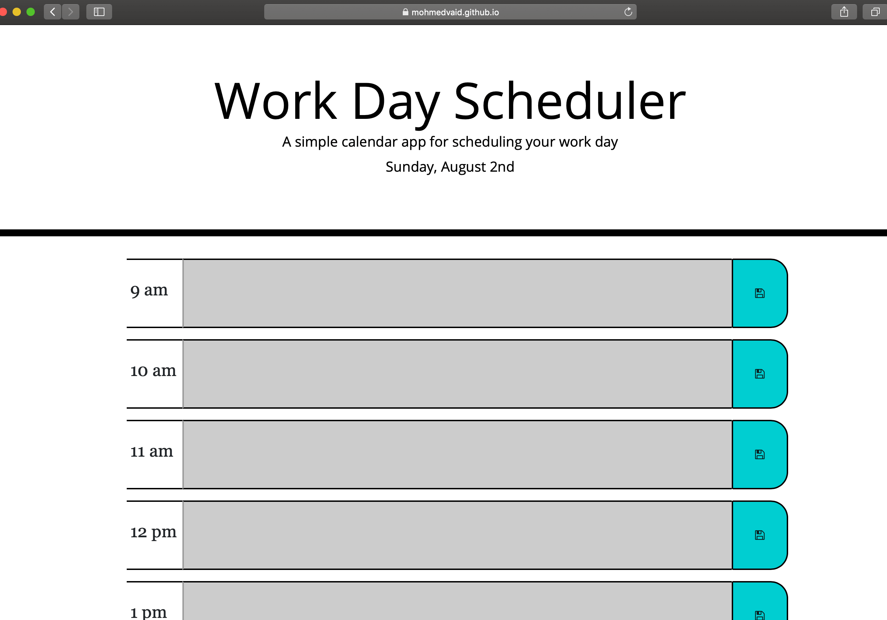

# work-day-planner v0.2.0

## Description

The work day scheduler is a simple calender that allows users to schedule, edit and delete events while saving them in local storage. The user the has the ability to have a daily planner and save events to local storage. This uses moment js to get the current date and time. The app sets the day/time using moment.js and displays current weekday, date and time in the heading. If the current time is past the event time the event will shade out. If the event is currently going on the event turns red and if the event is in the future the event will be green.

## Usage
https://mohmedvaid.github.io/work-day-scheduler/Develop/

## Credits
Bootstrap v4.4.1 https://getbootstrap.com/

JQuery v3.4.1 https://jquery.com/

Moment.js v2.24.0 https://momentjs.com/

Clock - https://cssanimation.rocks/clocks/ | https://codepen.io/JWardee/pen/XmMvGK

